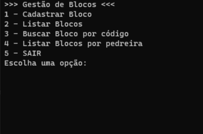
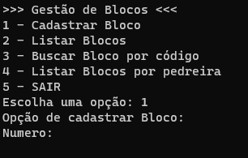
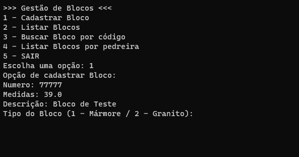
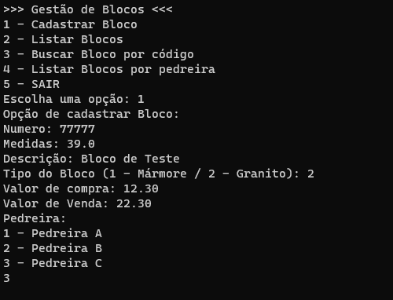
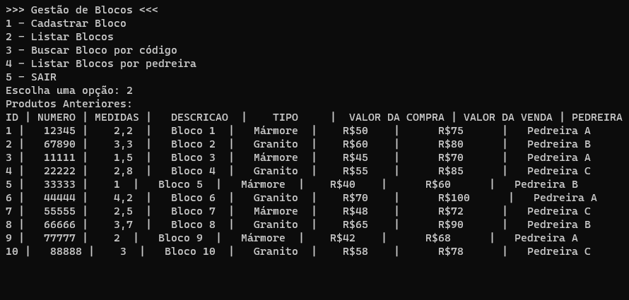
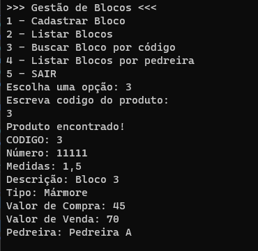
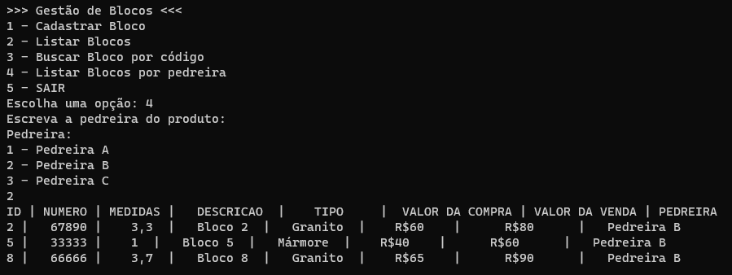
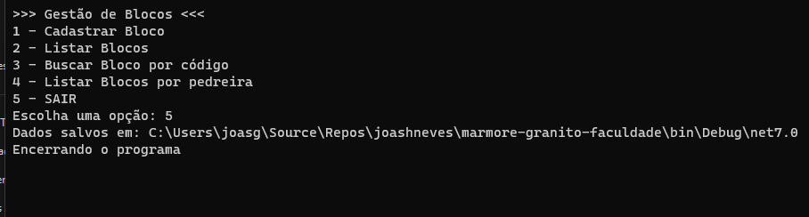
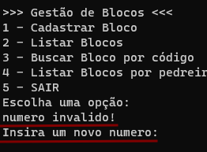
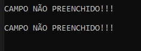

# marmore-granito-faculdade
Avaliação processual 3º bimestre do ano de 2023 - Sistemas de informação MULTIVIX
Grupo: Diogo Lima, Gellyorge Marvila, Joas Neves, Paulo Roberto

Este projeto foi desenvolvido como parte de um trabalho de faculdade. Ele consiste na criação de uma aplicação de console em C# para gerenciar o controle de blocos de mármore e granito para uma empresa fictícia chamada Max Rochas e Produtos Ornamentais. O objetivo principal do projeto é aplicar os conceitos e boas práticas de Engenharia de Software aprendidos no curso, abordando desde a análise de requisitos até a implementação funcional do sistema, proporcionando uma oportunidade prática de aplicar os conhecimentos adquiridos na disciplina.

## Guia:

- [Fucionalidades](#fucionalidades)
    - [menu](#menu)
    - [cadastro](#cadastro)
    - [Lista](#lista)
    - [Buscar](#buscar-por-codigo)
    - [Listar-Produto](#listar-por-pedreira)
    - [Sair](#sair)
- [Erros](#erros)

## fucionalidades
Aqui estão as seções que explicam como o código funciona e como são mostradas pelo sistema.

### menu
O menu aparece no console, mostrando 5 opções. O usuário digita um dos números exibidos na tela, que representa a opção subsequente. Por exemplo, ao digitar "1 - cadastrar", o usuário será levado à funcionalidade de cadastro.

### cadastro
Funcionalidade que solicita as informações para cadastrar um novo bloco.

Neste exemplo, após o usuário pressionar "1" para entrar nas opções de cadastro, a primeira informação solicitada é o número do bloco.

Após escolher o tipo de bloco, o sistema pede informações como número, medidas e descrição. Em seguida, o usuário seleciona o tipo de material, que pode ser Mármore ou Granito, e continua fornecendo informações sobre o valor da compra e o valor da venda.

Por fim, o sistema pergunta de qual pedreira o bloco foi retirado e oferece opções para o usuário escolher.

### Lista
Se o usuário pressionar "2" no menu, ele entrará na lista dos produtos cadastrados.

### Buscar por codigo
Se o usuário pressionar "3" no menu, ele terá a opção de inserir o código do produto que deseja procurar, o "ID". O código retornará todas as informações daquele ID específico.

### Listar por pedreira
Se o usuário pressionar "4" no menu, ele será direcionado para escolher uma das opções de pedreira que estão na lista da imagem. Após selecionar uma das 3 pedreiras, ele verá uma lista de todos os blocos que foram retirados daquela pedreira.

### Sair
Se o usuário pressionar "5", o programa avisara que salvou, e mostrar o diretorio aonde se encontra o arquivo, e por fim se encerrará.

## Erros
Se algum erro for encontrado, será exibida uma mensagem de alerta com os detalhes do problema.

Erro por numero em campo errado:

Erro por campo não preenchido:

